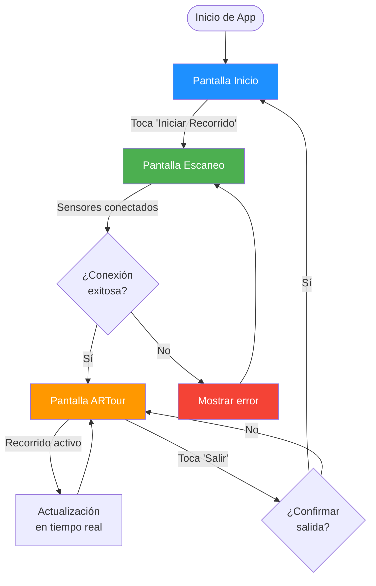
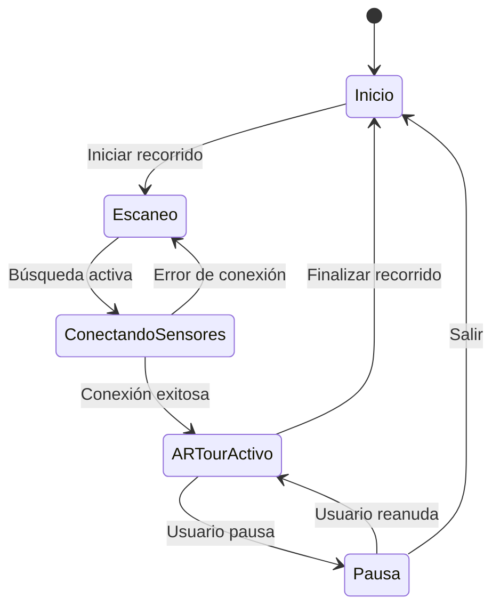

# Arquitectura del Módulo UI/UX - ARTour Virtual

## Índice
1. [Estructura de carpetas](#estructura-de-carpetas)
2. [Jerarquía de UIDocuments](#jerarquía-de-uidocuments)
3. [Flujo general de navegación](#flujo-general-de-navegación)
4. [Diagrama de flujo de pantallas](#diagrama-de-flujo-de-pantallas)
5. [Patrones de diseño aplicados](#patrones-de-diseño-aplicados)
6. [Gestión de estados](#gestión-de-estados)

---

## Estructura de carpetas

El módulo UI/UX se encuentra organizado dentro de `Assets/UIUX/` en Unity. Esta estructura modular permite una fácil navegación y mantenimiento del código:

```
Assets/UIUX/
├─ UIDocuments/              # Documentos UXML para cada pantalla
│  ├─ UIDocumentInicio.uxml
│  ├─ UIDocumentEscaneo.uxml
│  └─ UIDocumentARTour.uxml
├─ USS/                      # Hojas de estilo USS
│  ├─ EstilosGenerales.uss
│  ├─ PantallaInicio.uss
│  └─ PantallaARTour.uss
├─ Scripts/                  # Scripts de control y lógica
│  ├─ CambiadorDePantallas.cs
│  ├─ ControlUI.cs
│  ├─ AnimacionesUI.cs
│  └─ GestorEstados.cs
└─ Prefabs/                  # Componentes reutilizables
   ├─ ComponentesUI.prefab
   └─ BotonesGenericos.prefab
```

### Descripción de carpetas

**UIDocuments/**: Contiene todos los archivos `.uxml` que definen la estructura visual de cada pantalla. Cada documento representa una vista completa de la aplicación.

**USS/**: Almacena las hojas de estilo que definen la apariencia visual de los elementos UI. `EstilosGenerales.uss` contiene estilos compartidos entre todas las pantallas.

**Scripts/**: Contiene la lógica de negocio y control de la interfaz. Cada script tiene una responsabilidad específica siguiendo el principio de responsabilidad única (SRP).

**Prefabs/**: Componentes UI reutilizables que pueden ser instanciados en múltiples pantallas, asegurando consistencia visual y reduciendo duplicación de código.

---

## Jerarquía de UIDocuments

Cada pantalla en ARTour Virtual está representada por un `UIDocument` que actúa como contenedor raíz de todos los elementos visuales de esa vista específica.

### Estructura jerárquica típica

```
UIDocument (Raíz)
└─ VisualElement (Contenedor principal)
   ├─ VisualElement (Header)
   │  ├─ Label (Título)
   │  └─ Button (Botón de ayuda)
   ├─ VisualElement (Contenido)
   │  ├─ ScrollView (Contenido desplazable)
   │  └─ Button (Botón de acción)
   └─ VisualElement (Footer)
      └─ Label (Información adicional)
```

### Nomenclatura de elementos

Todos los elementos interactivos deben seguir la convención de nombres en camelCase con prefijos descriptivos:

- **Botones**: `btn` + Acción (ej: `btnIniciarRecorrido`)
- **Labels**: `lbl` + Descripción (ej: `lblTitulo`)
- **Contenedores**: `container` + Propósito (ej: `containerSensores`)
- **ScrollViews**: `scroll` + Contenido (ej: `scrollRutas`)

### Gestión de UIDocuments

Los `UIDocuments` se gestionan mediante el script `CambiadorDePantallas.cs`, que implementa el patrón Singleton para garantizar una única instancia del gestor de pantallas en toda la aplicación.

**Ejemplo de código:**

```csharp
public class CambiadorDePantallas : MonoBehaviour
{
    [SerializeField] private UIDocument pantallaInicio;
    [SerializeField] private UIDocument pantallaEscaneo;
    [SerializeField] private UIDocument pantallaARTour;
    
    private UIDocument pantallaActual;
    
    public void CambiarAPantalla(string nombrePantalla)
    {
        OcultarPantallaActual();
        MostrarNuevaPantalla(nombrePantalla);
    }
}
```

Los elementos internos (`VisualElement`, `Button`, `Label`) se organizan siguiendo la jerarquía definida en cada archivo `.uxml`, permitiendo un acceso eficiente mediante el método `Query` de UI Toolkit.

---

## Flujo general de navegación

El flujo de navegación en ARTour Virtual sigue un patrón secuencial con posibilidad de retroceso:

### Secuencia de navegación principal

1. **Inicio de la aplicación**: La aplicación carga automáticamente `PantallaInicio.uxml` como vista inicial.

2. **Interacción del usuario**: Las acciones del usuario (toques en botones, gestos) disparan eventos capturados por `CambiadorDePantallas.cs`.

3. **Transición entre pantallas**: El sistema oculta el UIDocument actual y muestra el siguiente mediante animaciones suaves.

4. **Aplicación de estilos**: Durante la transición, se aplican estilos dinámicos desde archivos `.uss` y scripts de animación.

5. **Actualización de estado**: El `GestorEstados.cs` mantiene el registro del estado actual de la aplicación para permitir navegación hacia atrás.

### Ciclo de vida de una pantalla

```
Inicialización → Carga de elementos → Aplicación de estilos → 
Registro de eventos → Pantalla activa → Limpieza → Desactivación
```

### Estados de pantalla

Cada pantalla puede estar en uno de los siguientes estados:

- **Inactiva**: No visible, sin recursos cargados
- **Cargando**: Inicializando elementos y recursos
- **Activa**: Totalmente visible e interactiva
- **Pausada**: Visible pero sin interacción
- **Transición**: Animándose hacia entrada o salida

---

## Diagrama de flujo de pantallas



### Descripción de transiciones

**Inicio → Escaneo**: Animación de fade-out del logo, seguida de slide-in de la pantalla de escaneo desde la derecha.

**Escaneo → ARTour**: Transición de fade con blur progresivo mientras se activa la cámara AR en segundo plano.

**ARTour → Inicio**: Fade-out completo de elementos 3D, seguido de restauración del estado inicial de la UI.

---

## Patrones de diseño aplicados

### 1. Singleton Pattern
El `CambiadorDePantallas` implementa el patrón Singleton para garantizar una única instancia del gestor de navegación.

```csharp
public class CambiadorDePantallas : MonoBehaviour
{
    private static CambiadorDePantallas _instance;
    
    public static CambiadorDePantallas Instance
    {
        get
        {
            if (_instance == null)
            {
                _instance = FindObjectOfType<CambiadorDePantallas>();
            }
            return _instance;
        }
    }
}
```

### 2. Observer Pattern
Los eventos de UI utilizan el patrón Observer para notificar cambios a múltiples suscriptores sin acoplamiento directo.

```csharp
public event Action<string> OnPantallaCambiada;

private void NotificarCambioPantalla(string nombrePantalla)
{
    OnPantallaCambiada?.Invoke(nombrePantalla);
}
```

### 3. State Pattern
El `GestorEstados` implementa una máquina de estados para controlar el comportamiento de la aplicación según la pantalla activa.

```csharp
public enum EstadoApp
{
    Inicio,
    Escaneo,
    ARTourActivo,
    Pausa
}
```

### 4. Command Pattern
Las acciones de botones se encapsulan en comandos reutilizables que pueden ser ejecutados, deshechos o registrados en un historial.

---

## Gestión de estados

### Máquina de estados de la aplicación

El módulo utiliza una máquina de estados finitos para controlar el flujo de la aplicación:

```csharp
public class GestorEstados : MonoBehaviour
{
    private EstadoApp estadoActual;
    private Stack<EstadoApp> historialEstados;
    
    public void CambiarEstado(EstadoApp nuevoEstado)
    {
        historialEstados.Push(estadoActual);
        estadoActual = nuevoEstado;
        EjecutarTransicion();
    }
    
    public void RetrocederEstado()
    {
        if (historialEstados.Count > 0)
        {
            estadoActual = historialEstados.Pop();
            EjecutarTransicion();
        }
    }
}
```

### Persistencia de estado

El estado de la aplicación se persiste automáticamente para permitir recuperación después de interrupciones:

- Estado actual de pantalla
- Progreso del usuario en el recorrido
- Configuraciones de usuario
- Caché de datos de sensores

### Diagrama de transición de estados



---

## Consideraciones de rendimiento

### Optimización de UIDocuments

- **Lazy loading**: Los UIDocuments se cargan solo cuando son necesarios
- **Pooling de elementos**: Los componentes frecuentes se reutilizan mediante object pooling
- **Batch rendering**: Los elementos visuales se agrupan para minimizar draw calls

### Gestión de memoria

```csharp
private void OnPantallaDesactivada(UIDocument pantalla)
{
    // Liberar recursos no esenciales
    pantalla.rootVisualElement.Clear();
    Resources.UnloadUnusedAssets();
}
```

### Métricas de rendimiento objetivo

- Tiempo de transición entre pantallas: < 300ms
- FPS mínimo durante animaciones: 60 FPS
- Memoria consumida por UI: < 50 MB
- Tiempo de respuesta a interacción: < 100ms

---

## Extensibilidad

### Cómo agregar nuevas pantallas

1. Crear archivo `.uxml` en `UIDocuments/`
2. Definir estilos específicos en `.uss`
3. Registrar en `CambiadorDePantallas`
4. Implementar lógica de navegación
5. Agregar al diagrama de flujo

### Plantilla de nueva pantalla

```csharp
public class NuevaPantallaController : MonoBehaviour
{
    private UIDocument documento;
    private VisualElement root;
    
    private void Awake()
    {
        documento = GetComponent<UIDocument>();
        root = documento.rootVisualElement;
        InicializarElementos();
        RegistrarEventos();
    }
    
    private void InicializarElementos()
    {
        // Inicializar elementos de UI
    }
    
    private void RegistrarEventos()
    {
        // Registrar eventos de botones y otros elementos
    }
}
```

---

## Referencias y recursos adicionales

- [Unity UI Toolkit Documentation](https://docs.unity3d.com/Manual/UIElements.html)
- Convenciones de código del proyecto: Ver `UIUX_Estilos.md`
- Guía de integración: Ver `UIUX_Integracion.md`
- Patrones de interacción: Ver `UIUX_Interacciones.md`