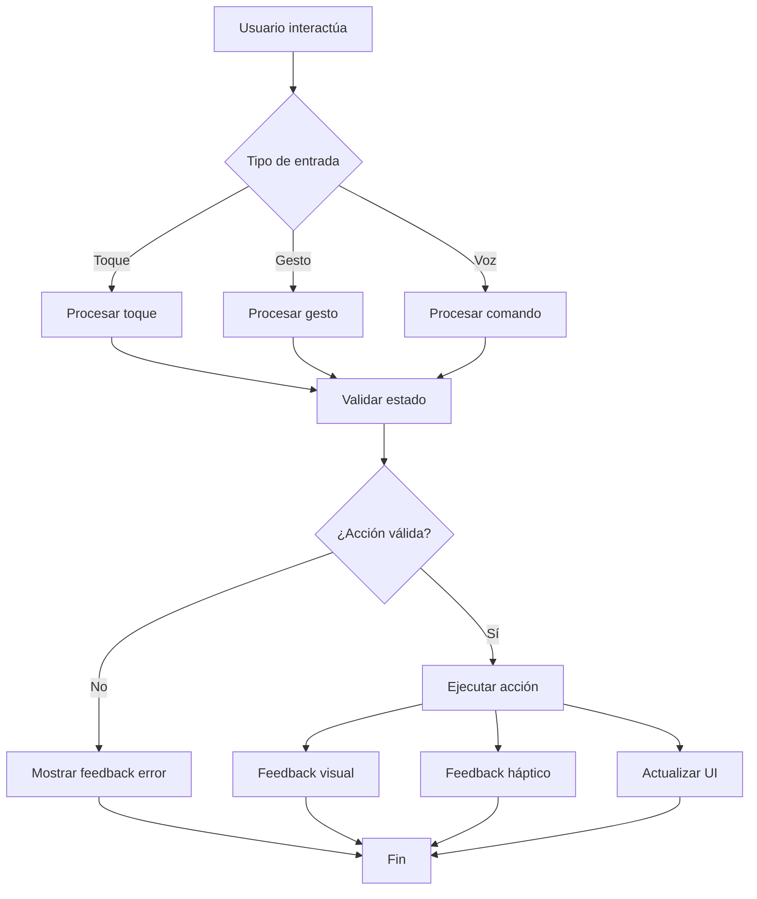

# Interacciones y eventos - ARTour Virtual

## Índice
1. [Sistema de interacción](#sistema-de-interacción)
2. [Botones y controles](#botones-y-controles)
3. [Gestos táctiles](#gestos-táctiles)
4. [Eventos del sistema](#eventos-del-sistema)
5. [Feedback de usuario](#feedback-de-usuario)
6. [Animaciones de interacción](#animaciones-de-interacción)
7. [Manejo de estados](#manejo-de-estados)
8. [Accesibilidad en interacciones](#accesibilidad-en-interacciones)

---

## Sistema de interacción

ARTour Virtual implementa un sistema robusto de interacciones que combina controles táctiles, gestos y retroalimentación visual/háptica para crear una experiencia intuitiva.

### Arquitectura del sistema de eventos

```csharp
public class SistemaInteracciones : MonoBehaviour
{
    public static SistemaInteracciones Instance { get; private set; }
    
    // Eventos globales
    public event Action<string> OnBotonPresionado;
    public event Action<Vector2> OnPantallaTocada;
    public event Action<string> OnPantallaCambiada;
    public event Action<string> OnUbicacionActualizada;
    
    private void Awake()
    {
        if (Instance == null)
        {
            Instance = this;
            DontDestroyOnLoad(gameObject);
        }
        else
        {
            Destroy(gameObject);
        }
    }
    
    public void RegistrarInteraccion(string tipoInteraccion, string datos = "")
    {
        // Logging para analytics
        Debug.Log($"Interacción: {tipoInteraccion} - {datos}");
        
        // Disparar eventos relevantes
        OnBotonPresionado?.Invoke(tipoInteraccion);
    }
}
```

### Flujo de procesamiento de interacciones



---

## Botones y controles

### Botones principales

Todos los botones principales de ARTour siguen el mismo patrón de interacción:

#### `BtnIniciarRecorrido` - Pantalla Inicio

**Ubicación**: Centro de Pantalla Inicio
**Función**: Inicia el proceso de escaneo de sensores

```csharp
public class BotonIniciarRecorrido : MonoBehaviour
{
    private Button btnIniciar;
    private bool procesando = false;
    
    private void Awake()
    {
        var root = GetComponent<UIDocument>().rootVisualElement;
        btnIniciar = root.Q<Button>("btnIniciarRecorrido");
        
        RegistrarEventos();
    }
    
    private void RegistrarEventos()
    {
        btnIniciar.RegisterCallback<ClickEvent>(OnBotonClick);
        btnIniciar.RegisterCallback<PointerEnterEvent>(OnPointerEnter);
        btnIniciar.RegisterCallback<PointerLeaveEvent>(OnPointerLeave);
    }
    
    private void OnBotonClick(ClickEvent evt)
    {
        if (procesando) return;
        
        procesando = true;
        
        // Feedback háptico
        Handheld.Vibrate();
        
        // Animación de botón
        AnimacionesUI.Instance.AnimarPresion(btnIniciar, () =>
        {
            // Registrar interacción
            SistemaInteracciones.Instance.RegistrarInteraccion("IniciarRecorrido");
            
            // Cambiar pantalla
            CambiadorDePantallas.Instance.CambiarAPantalla("Escaneo");
            
            procesando = false;
        });
    }
    
    private void OnPointerEnter(PointerEnterEvent evt)
    {
        // Efecto hover
        btnIniciar.AddToClassList("btn-hover");
    }
    
    private void OnPointerLeave(PointerLeaveEvent evt)
    {
        btnIniciar.RemoveFromClassList("btn-hover");
    }
}
```

**Eventos generados:**
- `OnBotonPresionado("IniciarRecorrido")`
- `OnPantallaCambiada("Escaneo")`

**Feedback:**
- Visual: Animación de escala (1.0 → 0.95 → 1.05 → 1.0)
- Háptico: Vibración corta (50ms)
- Auditivo: Sonido de clic suave (opcional)

---

#### `BtnContinuar` - Pantalla Escaneo

**Ubicación**: Parte inferior de Pantalla Escaneo
**Función**: Continúa a ARTour después de conexión exitosa
**Estado inicial**: Deshabilitado

```csharp
public class BotonContinuar : MonoBehaviour
{
    private Button btnContinuar;
    private bool sensoresConectados = false;
    
    private void Start()
    {
        btnContinuar = root.Q<Button>("btnContinuar");
        btnContinuar.SetEnabled(false);
        
        // Suscribirse a eventos de conexión
        GestorSensores.Instance.OnTodosSensoresConectados += HabilitarBoton;
        
        btnContinuar.clicked += OnContinuarClick;
    }
    
    private void HabilitarBoton()
    {
        sensoresConectados = true;
        
        // Animar habilitación
        LeanTween.value(gameObject, 0f, 1f, 0.5f)
            .setOnUpdate((float val) =>
            {
                btnContinuar.style.opacity = val;
            })
            .setOnComplete(() =>
            {
                btnContinuar.SetEnabled(true);
                btnContinuar.AddToClassList("btn-enabled");
            });
    }
    
    private void OnContinuarClick()
    {
        if (!sensoresConectados)
        {
            MostrarToast("Por favor espera a que se conecten todos los sensores");
            return;
        }
        
        // Feedback y transición
        Handheld.Vibrate();
        AnimacionesUI.Instance.AnimarSalida(pantallaEscaneo, () =>
        {
            CambiadorDePantallas.Instance.CambiarAPantalla("ARTour");
        });
    }
}
```

**Estados del botón:**
- `Deshabilitado`: Gris, no interactivo, opacidad 0.5
- `Habilitado`: Azul primary, interactivo, opacidad 1.0
- `Presionado`: Azul oscuro, escala 0.95

**Eventos generados:**
- `OnBotonPresionado("Continuar")`
- `OnPantallaCambiada("ARTour")`

---

#### `BtnSalir` - Pantalla ARTour

**Ubicación**: Parte inferior central de Pantalla ARTour
**Función**: Sale del recorrido AR con confirmación

```csharp
public class BotonSalir : MonoBehaviour
{
    private Button btnSalir;
    
    private void Awake()
    {
        btnSalir = root.Q<Button>("btnSalir");
        btnSalir.clicked += OnSalirClick;
    }
    
    private void OnSalirClick()
    {
        // Mostrar diálogo de confirmación
        GestorDialogos.MostrarConfirmacion(
            titulo: "¿Salir del recorrido?",
            mensaje: "Tu progreso se guardará automáticamente.",
            onConfirmar: () =>
            {
                GuardarProgreso();
                LimpiarRecursosAR();
                
                Handheld.Vibrate();
                CambiadorDePantallas.Instance.CambiarAPantalla("Inicio");
            },
            onCancelar: () =>
            {
                // Usuario canceló, no hacer nada
                Debug.Log("Usuario canceló salida");
            }
        );
    }
    
    private void GuardarProgreso()
    {
        ProgresoUsuario progreso = new ProgresoUsuario
        {
            ultimaSala = SalaActual,
            obrasVisitadas = ObrasVisitadas,
            tiempoTotal = TiempoEnRecorrido
        };
        
        PlayerPrefs.SetString("Progreso", JsonUtility.ToJson(progreso));
        PlayerPrefs.Save();
    }
    
    private void LimpiarRecursosAR()
    {
        ARSession.Reset();
        foreach (var marcador in marcadoresActivos)
        {
            Destroy(marcador.gameObject);
        }
        Resources.UnloadUnusedAssets();
    }
}
```

**Flujo de interacción:**
1. Usuario toca botón "Salir"
2. Aparece diálogo modal de confirmación
3. Usuario confirma o cancela
4. Si confirma: guardar progreso → limpiar AR → volver a inicio
5. Si cancela: cerrar diálogo, continuar en ARTour

---

### Botones secundarios

#### Botones de icono

```csharp
public class BotonesIcono : MonoBehaviour
{
    // Botón de ayuda
    private void ConfigurarBotonAyuda()
    {
        var btnAyuda = root.Q<Button>("btnAyuda");
        btnAyuda.clicked += () =>
        {
            MostrarPanelAyuda();
            SistemaInteracciones.Instance.RegistrarInteraccion("AbrirAyuda");
        };
    }
    
    // Botón de configuración
    private void ConfigurarBotonConfig()
    {
        var btnConfig = root.Q<Button>("btnConfiguracion");
        btnConfig.clicked += () =>
        {
            AbrirPanelConfiguracion();
            SistemaInteracciones.Instance.RegistrarInteraccion("AbrirConfiguracion");
        };
    }
    
    // Botón de audio
    private void ConfigurarBotonAudio()
    {
        var btnAudio = root.Q<Button>("btnAudio");
        btnAudio.clicked += () =>
        {
            ToggleAudio();
            ActualizarIconoAudio();
        };
    }
    
    private void ToggleAudio()
    {
        audioActivo = !audioActivo;
        
        if (audioActivo)
        {
            VozSinteticaManager.Instance.ReproducirInformacion(obraActual);
        }
        else
        {
            VozSinteticaManager.Instance.DetenerAudio();
        }
    }
}
```

---

## Gestos táctiles

### Gestos implementados

ARTour soporta los siguientes gestos táctiles para mejorar la experiencia del usuario:

#### 1. Tap (Toque simple)

**Uso**: Seleccionar elementos, presionar botones, interactuar con marcadores AR

```csharp
public class DetectorTap : MonoBehaviour
{
    private const float TAP_THRESHOLD_TIME = 0.3f; // 300ms
    private const float TAP_THRESHOLD_DISTANCE = 50f; // 50 pixels
    
    private Vector2 tapStartPosition;
    private float tapStartTime;
    
    private void Update()
    {
        if (Input.touchCount == 1)
        {
            Touch touch = Input.GetTouch(0);
            
            switch (touch.phase)
            {
                case TouchPhase.Began:
                    tapStartPosition = touch.position;
                    tapStartTime = Time.time;
                    break;
                
                case TouchPhase.Ended:
                    if (EsTap(touch))
                    {
                        OnTapDetectado(touch.position);
                    }
                    break;
            }
        }
    }
    
    private bool EsTap(Touch touch)
    {
        float duracion = Time.time - tapStartTime;
        float distancia = Vector2.Distance(tapStartPosition, touch.position);
        
        return duracion < TAP_THRESHOLD_TIME && distancia < TAP_THRESHOLD_DISTANCE;
    }
    
    private void OnTapDetectado(Vector2 posicion)
    {
        // Detectar objeto AR tocado
        Ray ray = Camera.main.ScreenPointToRay(posicion);
        RaycastHit hit;
        
        if (Physics.Raycast(ray, out hit))
        {
            var marcador = hit.collider.GetComponent<MarcadorAR>();
            if (marcador != null)
            {
                marcador.OnTap();
            }
        }
        
        // Notificar evento
        SistemaInteracciones.Instance.OnPantallaTocada?.Invoke(posicion);
    }
}
```

#### 2. Long Press (Mantener presionado)

**Uso**: Mostrar opciones adicionales, menú contextual

```csharp
public class DetectorLongPress : MonoBehaviour
{
    private const float LONG_PRESS_DURATION = 0.8f; // 800ms
    private float pressStartTime;
    private bool longPressDetectado = false;
    
    private void Update()
    {
        if (Input.touchCount == 1)
        {
            Touch touch = Input.GetTouch(0);
            
            switch (touch.phase)
            {
                case TouchPhase.Began:
                    pressStartTime = Time.time;
                    longPressDetectado = false;
                    break;
                
                case TouchPhase.Stationary:
                    if (!longPressDetectado && 
                        Time.time - pressStartTime >= LONG_PRESS_DURATION)
                    {
                        longPressDetectado = true;
                        OnLongPress(touch.position);
                        Handheld.Vibrate(); // Feedback háptico
                    }
                    break;
                
                case TouchPhase.Ended:
                case TouchPhase.Canceled:
                    longPressDetectado = false;
                    break;
            }
        }
    }
    
    private void OnLongPress(Vector2 posicion)
    {
        Debug.Log($"Long press detectado en: {posicion}");
        
        // Mostrar menú contextual
        MostrarMenuContextual(posicion);
    }
}
```

#### 3. Swipe (Deslizar)

**Uso**: Navegar entre pantallas, desplazar contenido

```csharp
public class DetectorSwipe : MonoBehaviour
{
    private const float SWIPE_THRESHOLD = 100f; // 100 pixels mínimo
    private Vector2 swipeStartPosition;
    
    public event Action OnSwipeIzquierda;
    public event Action OnSwipeDerecha;
    public event Action OnSwipeArriba;
    public event Action OnSwipeAbajo;
    
    private void Update()
    {
        if (Input.touchCount == 1)
        {
            Touch touch = Input.GetTouch(0);
            
            switch (touch.phase)
            {
                case TouchPhase.Began:
                    swipeStartPosition = touch.position;
                    break;
                
                case TouchPhase.Ended:
                    DetectarDireccionSwipe(touch.position);
                    break;
            }
        }
    }
    
    private void DetectarDireccionSwipe(Vector2 endPosition)
    {
        Vector2 diff = endPosition - swipeStartPosition;
        
        if (diff.magnitude < SWIPE_THRESHOLD)
            return;
        
        // Determinar si es horizontal o vertical
        if (Mathf.Abs(diff.x) > Mathf.Abs(diff.y))
        {
            // Swipe horizontal
            if (diff.x > 0)
                OnSwipeDerecha?.Invoke();
            else
                OnSwipeIzquierda?.Invoke();
        }
        else
        {
            // Swipe vertical
            if (diff.y > 0)
                OnSwipeArriba?.Invoke();
            else
                OnSwipeAbajo?.Invoke();
        }
    }
}
```

**Uso en pantallas:**

```csharp
// En Pantalla ARTour - Swipe hacia abajo para mostrar más info
detectorSwipe.OnSwipeAbajo += () =>
{
    MostrarPanelInformacionCompleta();
};

// Swipe hacia arriba para ocultar info
detectorSwipe.OnSwipeArriba += () =>
{
    OcultarPanelInformacionCompleta();
};
```

#### 4. Pinch to Zoom

**Uso**: Acercar/alejar en vista de mapa o detalles de obra

```csharp
public class DetectorPinch : MonoBehaviour
{
    private float previousTouchDistance;
    public event Action<float> OnPinchZoom; // Delta de zoom
    
    private void Update()
    {
        if (Input.touchCount == 2)
        {
            Touch touch1 = Input.GetTouch(0);
            Touch touch2 = Input.GetTouch(1);
            
            if (touch1.phase == TouchPhase.Moved || touch2.phase == TouchPhase.Moved)
            {
                float currentDistance = Vector2.Distance(touch1.position, touch2.position);
                
                if (previousTouchDistance > 0)
                {
                    float delta = currentDistance - previousTouchDistance;
                    OnPinchZoom?.Invoke(delta);
                }
                
                previousTouchDistance = currentDistance;
            }
        }
        else
        {
            previousTouchDistance = 0;
        }
    }
}
```

---

## Eventos del sistema

### Eventos de sensores y trilateración

```csharp
public class EventosSensores : MonoBehaviour
{
    // Eventos de conexión
    public event Action<string> OnSensorDetectado;
    public event Action<string> OnSensorConectado;
    public event Action<string> OnSensorDesconectado;
    public event Action OnTodosSensoresConectados;
    
    // Eventos de ubicación
    public event Action<Vector3> OnUbicacionActualizada;
    public event Action<string> OnSalaCambiada;
    public event Action<ObraDeArte> OnObraCercana;
    
    // Ejemplo de uso
    private void Start()
    {
        GestorSensores.Instance.OnSensorConectado += (nombre) =>
        {
            Debug.Log($"Sensor conectado: {nombre}");
            ActualizarUIListaSensores(nombre, true);
        };
        
        TrilateracionManager.Instance.OnUbicacionActualizada += (posicion) =>
        {
            ActualizarPanelUbicacion(posicion);
            VerificarObreasCercanas(posicion);
        };
    }
}
```

### Eventos de navegación

```csharp
public class EventosNavegacion : MonoBehaviour
{
    public event Action<string> OnPantallaCambiada;
    public event Action<string> OnRutaIniciada;
    public event Action<PuntoInteres> OnPuntoInteresAlcanzado;
    public event Action OnRecorridoCompletado;
    
    // Implementación
    public void IniciarRuta(string nombreRuta)
    {
        rutaActual = ObtenerRuta(nombreRuta);
        OnRutaIniciada?.Invoke(nombreRuta);
        
        // Configurar waypoints
        ConfigurarWaypoints(rutaActual);
    }
    
    private void Update()
    {
        if (rutaActual != null)
        {
            VerificarProgresoRuta();
        }
    }
    
    private void VerificarProgresoRuta()
    {
        var ubicacionActual = TrilateracionManager.Instance.ObtenerPosicion();
        var puntoMasCercano = rutaActual.ObtenerPuntoMasCercano(ubicacionActual);
        
        if (Vector3.Distance(ubicacionActual, puntoMasCercano.posicion) < 2f)
        {
            if (!puntoMasCercano.alcanzado)
            {
                puntoMasCercano.alcanzado = true;
                OnPuntoInteresAlcanzado?.Invoke(puntoMasCercano);
                
                // Reproducir información de audio
                VozSinteticaManager.Instance.ReproducirInformacion(puntoMasCercano.id);
            }
        }
        
        // Verificar si completó el recorrido
        if (rutaActual.TodosPuntosAlcanzados())
        {
            OnRecorridoCompletado?.Invoke();
            MostrarPantallaFelicitaciones();
        }
    }
}
```

---

## Feedback de usuario

### Feedback visual

#### Animaciones de estado

```csharp
public class FeedbackVisual : MonoBehaviour
{
    // Feedback de éxito
    public void MostrarExito(VisualElement elemento)
    {
        var checkmark = new VisualElement();
        checkmark.AddToClassList("checkmark-animation");
        elemento.Add(checkmark);
        
        LeanTween.scale(checkmark, Vector3.one * 1.5f, 0.3f)
            .setEase(LeanTweenType.easeOutBack)
            .setOnComplete(() =>
            {
                elemento.schedule.Execute(() =>
                {
                    elemento.Remove(checkmark);
                }).StartingIn(1000);
            });
    }
    
    // Feedback de error
    public void MostrarError(VisualElement elemento)
    {
        // Shake animation
        Vector3 posicionOriginal = elemento.transform.position;
        
        LeanTween.value(gameObject, 0f, 1f, 0.5f)
            .setOnUpdate((float val) =>
            {
                float offset = Mathf.Sin(val * Mathf.PI * 8) * 10f * (1f - val);
                elemento.transform.position = posicionOriginal + new Vector3(offset, 0, 0);
            })
            .setOnComplete(() =>
            {
                elemento.transform.position = posicionOriginal;
            });
        
        // Cambiar color temporalmente
        Color colorOriginal = elemento.resolvedStyle.backgroundColor;
        elemento.style.backgroundColor = new StyleColor(Color.red);
        
        elemento.schedule.Execute(() =>
        {
            elemento.style.backgroundColor = colorOriginal;
        }).StartingIn(500);
    }
    
    // Feedback de carga
    public void MostrarCargando(VisualElement contenedor)
    {
        var spinner = new VisualElement();
        spinner.AddToClassList("spinner");
        contenedor.Add(spinner);
        
        // Rotación continua
        LeanTween.rotateZ(spinner.gameObject, 360f, 1f)
            .setLoopClamp()
            .setEase(LeanTweenType.linear);
    }
}
```

### Feedback háptico

```csharp
public class FeedbackHaptico : MonoBehaviour
{
    public enum TipoVibracion
    {
        Suave,      // 50ms
        Medio,      // 100ms
        Fuerte,     // 200ms
        Patron      // Patrón custom
    }
    
    public static void Vibrar(TipoVibracion tipo)
    {
        #if UNITY_ANDROID || UNITY_IOS
        switch (tipo)
        {
            case TipoVibracion.Suave:
                Handheld.Vibrate();
                break;
            
            case TipoVibracion.Medio:
                // Android/iOS tienen APIs específicas para duraciones
                #if UNITY_ANDROID
                VibrarAndroid(100);
                #elif UNITY_IOS
                VibrariOS(100);
                #endif
                break;
            
            case TipoVibracion.Fuerte:
                #if UNITY_ANDROID
                VibrarAndroid(200);
                #elif UNITY_IOS
                VibrariOS(200);
                #endif
                break;
            
            case TipoVibracion.Patron:
                VibrarPatron(new long[] { 0, 100, 50, 100 });
                break;
        }
        #endif
    }
    
    #if UNITY_ANDROID
    private static void VibrarAndroid(long duracion)
    {
        using (var vibrator = new AndroidJavaClass("android.os.Vibrator"))
        {
            using (var context = GetAndroidContext())
            {
                vibrator.Call("vibrate", duracion);
            }
        }
    }
    #endif
    
    private static void VibrarPatron(long[] patron)
    {
        // Implementación de patrón de vibración
        // [pausa, vibración, pausa, vibración, ...]
    }
}
```

**Uso en interacciones:**

```csharp
// Al presionar botón principal
btnPrincipal.clicked += () =>
{
    FeedbackHaptico.Vibrar(FeedbackHaptico.TipoVibracion.Suave);
    // ... resto de lógica
};

// Al completar recorrido
private void OnRecorridoCompletado()
{
    FeedbackHaptico.Vibrar(FeedbackHaptico.TipoVibracion.Patron);
    MostrarPantallaFelicitaciones();
}

// Al detectar error
private void OnError()
{
    FeedbackHaptico.Vibrar(FeedbackHaptico.TipoVibracion.Fuerte);
    FeedbackVisual.Instance.MostrarError(elemento);
}
```

### Feedback auditivo

```csharp
public class FeedbackAuditivo : MonoBehaviour
{
    [SerializeField] private AudioClip sonidoClick;
    [SerializeField] private AudioClip sonidoExito;
    [SerializeField] private AudioClip sonidoError;
    [SerializeField] private AudioClip sonidoNotificacion;
    
    private AudioSource audioSource;
    
    private void Awake()
    {
        audioSource = gameObject.AddComponent<AudioSource>();
        audioSource.playOnAwake = false;
    }
    
    public void ReproducirClick()
    {
        if (PlayerPrefs.GetInt("SonidosUI", 1) == 1)
        {
            audioSource.PlayOneShot(sonidoClick, 0.5f);
        }
    }
    
    public void ReproducirExito()
    {
        if (PlayerPrefs.GetInt("SonidosUI", 1) == 1)
        {
            audioSource.PlayOneShot(sonidoExito, 0.7f);
        }
    }
    
    public void ReproducirError()
    {
        if (PlayerPrefs.GetInt("SonidosUI", 1) == 1)
        {
            audioSource.PlayOneShot(sonidoError, 0.6f);
        }