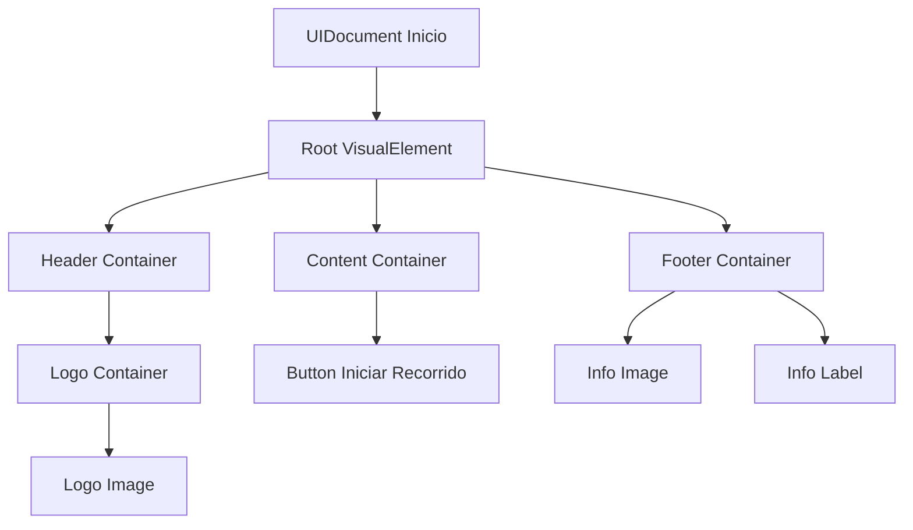

# Pantallas y elementos UI - ARTour Virtual

## Índice
1. [Pantalla Inicio](#pantalla-inicio)
2. [Pantalla Escaneo](#pantalla-escaneo)
3. [Pantalla ARTour](#pantalla-artour)
4. [Componentes recurrentes](#componentes-recurrentes)
5. [Elementos especiales](#elementos-especiales)
6. [Accesibilidad](#accesibilidad)

---

## Pantalla Inicio

La pantalla de inicio es la primera vista que encuentra el usuario al abrir ARTour Virtual. Su diseño busca ser acogedor y claro, proporcionando una entrada intuitiva a la experiencia.

### Estructura visual

```
┌──────────────────────────────────────┐
│           [Logo ARTour]              │
│                                      │
│      ┌────────────────────┐         │
│      │  Iniciar recorrido │         │
│      └────────────────────┘         │
│                                      │
│    [Imagen informativa museo]       │
└──────────────────────────────────────┘
```

### Elementos principales

#### 1. Logo de la aplicación
- **Tipo**: `VisualElement` con clase `logo-container`
- **Ubicación**: Parte superior central
- **Dimensiones**: 200x120 pt
- **Comportamiento**: Animación sutil de fade-in al cargar (duración: 0.8s)

```xml
<ui:VisualElement name="logoContainer" class="logo-container">
    <ui:VisualElement name="logoImage" class="logo-image" />
</ui:VisualElement>
```

#### 2. Botón "Iniciar recorrido"
- **Tipo**: `Button`
- **ID**: `btnIniciarRecorrido`
- **Ubicación**: Centro de pantalla
- **Dimensiones**: 280x60 pt
- **Comportamiento**: 
  - Al presionar: transición hacia Pantalla Escaneo
  - Animación de hover: escala 1.05 y cambio de color
  - Efecto ripple al tocar

```csharp
// Código de registro del evento
btnIniciarRecorrido.RegisterCallback<ClickEvent>(evt => 
{
    AnimacionesUI.Instance.AnimarSalida(pantallaInicio, () =>
    {
        CambiadorDePantallas.Instance.CambiarAPantalla("Escaneo");
    });
});
```

#### 3. Footer informativo
- **Tipo**: `VisualElement` con `Label` interno
- **Contenido**: Imagen del museo y texto descriptivo breve
- **Ubicación**: Parte inferior
- **Comportamiento**: Siempre visible, scroll horizontal si es necesario

### Estilos aplicados

```css
/* EstilosGenerales.uss */
.logo-container {
    flex-grow: 0;
    align-items: center;
    justify-content: center;
    margin-top: 80px;
    margin-bottom: 40px;
}

.logo-image {
    width: 200px;
    height: 120px;
    background-image: url('/Assets/Images/logo_artour.png');
}

#btnIniciarRecorrido {
    width: 280px;
    height: 60px;
    background-color: #1E90FF;
    color: #FFFFFF;
    font-size: 18px;
    border-radius: 30px;
    border-width: 0;
    -unity-font-style: bold;
    transition-duration: 0.3s;
}

#btnIniciarRecorrido:hover {
    scale: 1.05;
    background-color: #1C7ED6;
}
```

### Comportamiento y flujo

1. **Carga inicial**: La pantalla se renderiza con una animación de fade-in de 800ms
2. **Estado idle**: El logo puede tener una animación sutil de respiración (scale 1.0 → 1.02 → 1.0)
3. **Interacción**: Al tocar el botón principal, se ejecuta:
   - Feedback háptico (vibración corta)
   - Animación de salida de elementos (fade-out secuencial)
   - Transición a Pantalla Escaneo
4. **Manejo de errores**: Si hay problemas de carga, se muestra un mensaje de error no intrusivo

### Diagrama de jerarquía de elementos



### Consideraciones de diseño

- **Accesibilidad**: El botón principal tiene un tamaño mínimo de 60pt de altura para facilitar la interacción
- **Adaptabilidad**: Los elementos se reorganizan en orientación horizontal
- **Rendimiento**: Las imágenes están optimizadas en formato PNG con compresión
- **Localización**: Todos los textos utilizan claves de traducción para soporte multiidioma

---

## Pantalla Escaneo

La pantalla de escaneo simula el proceso de conexión con los sensores BLE del museo. Es una pantalla de transición crítica que informa al usuario sobre el estado de la conexión.

### Estructura visual

```
┌──────────────────────────────────────┐
│    Conectando con sensores...        │
│                                      │
│  ┌────────────────────────────────┐ │
│  │ ⊙ Sensor Entrada      [✓]     │ │
│  │ ⊙ Sensor Sala 1       [...]   │ │
│  │ ⊙ Sensor Sala 2       [...]   │ │
│  │ ⊙ Sensor Sala 3       [...]   │ │
│  └────────────────────────────────┘ │
│                                      │
│  [████████░░░░] 75%                 │
│                                      │
│      ┌────────────────┐             │
│      │    Continuar    │             │
│      └────────────────┘             │
└──────────────────────────────────────┘
```

### Elementos principales

#### 1. Título de estado
- **Tipo**: `Label`
- **ID**: `lblEstadoConexion`
- **Contenido**: "Conectando con sensores..." / "Sensores conectados"
- **Comportamiento**: Actualización dinámica según estado de conexión

#### 2. Lista de sensores
- **Tipo**: `ScrollView` con `ListView`
- **ID**: `listaSensores`
- **Elementos**: Items dinámicos representando cada sensor
- **Comportamiento**: 
  - Actualización en tiempo real del estado de cada sensor
  - Iconos animados para indicar proceso de conexión
  - Checkmark verde cuando sensor conectado exitosamente

```xml
<ui:ScrollView name="scrollSensores" class="scroll-sensores">
    <ui:ListView name="listaSensores" class="lista-sensores" />
</ui:ScrollView>
```

**Estructura de cada item de sensor:**

```xml
<ui:VisualElement class="sensor-item">
    <ui:VisualElement class="sensor-icon" />
    <ui:Label name="sensorNombre" class="sensor-nombre" text="Sensor Entrada" />
    <ui:VisualElement class="sensor-status" />
</ui:VisualElement>
```

#### 3. Indicador de progreso
- **Tipo**: `ProgressBar` custom
- **ID**: `progressBarConexion`
- **Rango**: 0-100
- **Comportamiento**: 
  - Incremento progresivo basado en sensores conectados
  - Animación suave de relleno
  - Cambio de color según progreso (rojo → amarillo → verde)

```csharp
// Actualización del progress bar
private void ActualizarProgreso(int sensoresConectados, int totalSensores)
{
    float progreso = (float)sensoresConectados / totalSensores * 100f;
    progressBar.value = progreso;
    
    // Cambiar color según progreso
    if (progreso < 50f)
        progressBar.style.backgroundColor = new StyleColor(Color.red);
    else if (progreso < 100f)
        progressBar.style.backgroundColor = new StyleColor(Color.yellow);
    else
        progressBar.style.backgroundColor = new StyleColor(Color.green);
}
```

#### 4. Botón "Continuar"
- **Tipo**: `Button`
- **ID**: `btnContinuar`
- **Estado inicial**: Deshabilitado
- **Comportamiento**: 
  - Se habilita solo cuando todos los sensores están conectados
  - Al presionar: transición a Pantalla ARTour
  - Bypass temporal: Se activa después de 3 segundos para pruebas

```csharp
// Bypass temporal para desarrollo
#if UNITY_EDITOR
    StartCoroutine(HabilitarBotonDespuesDeTiempo(3f));
#endif

private IEnumerator HabilitarBotonDespuesDeTiempo(float segundos)
{
    yield return new WaitForSeconds(segundos);
    btnContinuar.SetEnabled(true);
    lblEstadoConexion.text = "Sensores conectados (simulado)";
    progressBar.value = 100f;
}
```

### Sistema de simulación

Para facilitar el desarrollo sin hardware físico, la pantalla implementa un sistema de simulación de conexión:

```csharp
public class SimuladorConexionSensores : MonoBehaviour
{
    [SerializeField] private bool modoSimulacion = true;
    [SerializeField] private float tiempoEntreSensores = 0.8f;
    
    private List<string> sensoresSimulados = new List<string>
    {
        "Sensor Entrada",
        "Sensor Sala 1",
        "Sensor Sala 2",
        "Sensor Sala 3"
    };
    
    public IEnumerator SimularConexion()
    {
        foreach (string sensor in sensoresSimulados)
        {
            yield return new WaitForSeconds(tiempoEntreSensores);
            OnSensorConectado?.Invoke(sensor);
        }
    }
}
```

### Estilos aplicados

```css
/* PantallaEscaneo.uss */
.scroll-sensores {
    flex-grow: 1;
    margin: 20px;
    max-height: 300px;
}

.sensor-item {
    flex-direction: row;
    align-items: center;
    padding: 15px;
    margin-bottom: 10px;
    background-color: #FFFFFF;
    border-radius: 10px;
    border-width: 1px;
    border-color: #E0E0E0;
}

.sensor-icon {
    width: 24px;
    height: 24px;
    background-image: url('/Assets/Icons/bluetooth_icon.png');
    margin-right: 15px;
}

.sensor-nombre {
    flex-grow: 1;
    font-size: 16px;
    color: #333333;
}

.sensor-status {
    width: 24px;
    height: 24px;
}

#progressBarConexion {
    height: 20px;
    margin: 20px 40px;
    border-radius: 10px;
    background-color: #E0E0E0;
}
```

### Manejo de errores

La pantalla implementa manejo de errores robusto para diferentes escenarios:

1. **Error de conexión Bluetooth**: Mensaje explicativo con opción de reintentar
2. **Timeout de conexión**: Después de 30 segundos sin conexión exitosa
3. **Sensor no disponible**: Se marca en rojo y se permite continuar sin él (si no es crítico)
4. **Error de permisos**: Solicitud al usuario para habilitar Bluetooth y ubicación

```csharp
private void ManejarErrorConexion(string tipoError)
{
    switch (tipoError)
    {
        case "bluetooth_disabled":
            MostrarDialogoError(
                "Bluetooth desactivado",
                "Por favor, activa el Bluetooth para continuar.",
                "Configuración",
                AbrirConfiguracionBluetooth
            );
            break;
        
        case "timeout":
            MostrarDialogoError(
                "Conexión agotada",
                "No se pudo conectar con todos los sensores. ¿Deseas reintentar?",
                "Reintentar",
                ReiniciarEscaneo
            );
            break;
        
        case "permission_denied":
            MostrarDialogoError(
                "Permisos necesarios",
                "ARTour necesita permisos de ubicación para funcionar.",
                "Dar permisos",
                SolicitarPermisos
            );
            break;
    }
}
```

### Consideraciones técnicas

- **Actualización de UI**: Se realiza en el hilo principal usando `UnityMainThreadDispatcher`
- **Caché de sensores**: Los sensores descubiertos se cachean para reconexión rápida
- **Logs**: Todos los eventos de conexión se registran para depuración
- **Timeout**: Implementado con `CancellationToken` para limpieza adecuada

---

## Pantalla ARTour

La pantalla ARTour es la vista principal de la aplicación donde ocurre la experiencia de realidad aumentada. Combina la vista de cámara con elementos UI informativos y controles de navegación.

### Estructura visual en capas

```
Capa 1 (Fondo):  [Vista de cámara AR]
Capa 2 (AR):     [Marcadores 3D y objetos virtuales]
Capa 3 (UI):     [Elementos de interfaz]

┌──────────────────────────────────────┐
│  [?]              ARTour        [⚙]  │ ← Header
│                                      │
│         [Vista de cámara AR]         │
│         Con marcadores 3D            │
│                                      │
│  ┌────────────────────────────────┐ │
│  │ 📍 Sala Principal              │ │ ← Info ubicación
│  │ Ruta: Recorrido Clásico       │ │
│  │ Nivel 1 de 3                   │ │
│  └────────────────────────────────┘ │
│                                      │
│  ┌────────────────────────────────┐ │
│  │ La Gioconda - Leonardo da Vinci│ │ ← Footer dinámico
│  │ [  🔊  ]  [  ❤  ]  [ Info ]   │ │
│  └────────────────────────────────┘ │
│                                      │
│              [× Salir]               │ ← Botón salida
└──────────────────────────────────────┘
```

### Elementos principales

#### 1. Vista de cámara AR (Background)
- **Tipo**: `ARCameraBackground` de AR Foundation
- **Comportamiento**: 
  - Stream continuo de cámara en tiempo real
  - Detección automática de planos horizontales
  - Renderizado de objetos virtuales sobre el mundo real

```csharp
// Configuración de la cámara AR
private void ConfigurarCamaraAR()
{
    ARCameraManager cameraManager = GetComponent<ARCameraManager>();
    cameraManager.requestedFacingDirection = CameraFacingDirection.World;
    
    // Configurar calidad de imagen
    if (cameraManager.subsystem != null)
    {
        cameraManager.subsystem.requestedCamera = CameraFacing.World;
    }
}
```

#### 2. Header con controles
- **Botón de ayuda** (`?`): Muestra tutorial contextual
- **Título de la app**: "ARTour" - siempre visible
- **Botón de configuración** (`⚙`): Acceso a ajustes rápidos

```xml
<ui:VisualElement name="headerContainer" class="header-artour">
    <ui:Button name="btnAyuda" class="btn-icon" text="?" />
    <ui:Label name="lblTitulo" class="titulo-artour" text="ARTour" />
    <ui:Button name="btnConfiguracion" class="btn-icon" text="⚙" />
</ui:VisualElement>
```

#### 3. Panel de información de ubicación
- **Tipo**: `VisualElement` flotante con backdrop blur
- **ID**: `panelUbicacion`
- **Ubicación**: Parte superior-media, semi-transparente
- **Contenido**:
  - Icono de ubicación con animación de pulso
  - Nombre de la sala actual
  - Nombre de la ruta activa
  - Nivel del recorrido (ej: "Nivel 1 de 3")

```xml
<ui:VisualElement name="panelUbicacion" class="panel-ubicacion">
    <ui:VisualElement class="icono-ubicacion-container">
        <ui:VisualElement name="iconoUbicacion" class="icono-ubicacion" />
    </ui:VisualElement>
    <ui:Label name="lblSalaActual" class="lbl-sala" text="Sala Principal" />
    <ui:Label name="lblRuta" class="lbl-ruta" text="Ruta: Recorrido Clásico" />
    <ui:Label name="lblNivel" class="lbl-nivel" text="Nivel 1 de 3" />
</ui:VisualElement>
```

**Comportamiento dinámico:**

```csharp
public class PanelUbicacionController : MonoBehaviour
{
    private Label lblSalaActual;
    private Label lblRuta;
    private Label lblNivel;
    
    public void ActualizarUbicacion(DatosUbicacion datos)
    {
        // Animación de fade out → actualización → fade in
        StartCoroutine(ActualizarConAnimacion(datos));
    }
    
    private IEnumerator ActualizarConAnimacion(DatosUbicacion datos)
    {
        yield return AnimacionesUI.Instance.FadeOut(panelUbicacion, 0.2f);
        
        lblSalaActual.text = datos.nombreSala;
        lblRuta.text = $"Ruta: {datos.nombreRuta}";
        lblNivel.text = $"Nivel {datos.nivelActual} de {datos.nivelTotal}";
        
        yield return AnimacionesUI.Instance.FadeIn(panelUbicacion, 0.3f);
    }
}
```

#### 4. Marcadores AR interactivos
- **Tipo**: GameObjects 3D renderizados sobre planos detectados
- **Comportamiento**:
  - Aparecen automáticamente cerca de obras de arte
  - Animación de aparición con scale y rotación
  - Al tocar: reproducen información de audio
  - Indicador visual cuando están activos

```csharp
public class MarcadorAR : MonoBehaviour
{
    [SerializeField] private GameObject modeloPrefab;
    [SerializeField] private float alturaFlotacion = 0.2f;
    
    private void Start()
    {
        AnimarAparicion();
    }
    
    private void AnimarAparicion()
    {
        transform.localScale = Vector3.zero;
        LeanTween.scale(gameObject, Vector3.one, 0.5f)
            .setEase(LeanTweenType.easeOutBack);
        
        // Flotación continua
        LeanTween.moveY(gameObject, transform.position.y + alturaFlotacion, 1.5f)
            .setLoopPingPong()
            .setEase(LeanTweenType.easeInOutSine);
    }
    
    private void OnMouseDown()
    {
        // Reproducir información de audio
        VozSinteticaManager.Instance.ReproducirInformacion(idObra);
        
        // Feedback visual
        LeanTween.scale(gameObject, Vector3.one * 1.2f, 0.2f)
            .setLoopPingPong(1);
    }
}
```

#### 5. Footer dinámico de obra
- **Tipo**: `VisualElement` con información contextual
- **ID**: `footerObra`
- **Contenido**:
  - Nombre de la obra
  - Artista
  - Controles de audio, favoritos e información

```xml
<ui:VisualElement name="footerObra" class="footer-obra">
    <ui:VisualElement class="info-obra-container">
        <ui:Label name="lblNombreObra" class="nombre-obra" text="La Gioconda" />
        <ui:Label name="lblArtista" class="artista-obra" text="Leonardo da Vinci" />
    </ui:VisualElement>
    <ui:VisualElement class="controles-obra">
        <ui:Button name="btnAudio" class="btn-control" />
        <ui:Button name="btnFavorito" class="btn-control" />
        <ui:Button name="btnInfoObra" class="btn-control" text="Info" />
    </ui:VisualElement>
</ui:VisualElement>
```

**Actualización dinámica basada en proximidad:**

```csharp
public class FooterObraController : MonoBehaviour
{
    private Label lblNombreObra;
    private Label lblArtista;
    private Button btnAudio;
    
    private void Update()
    {
        // Detectar obra más cercana
        ObraDeArte obraCercana = DetectarObraCercana();
        
        if (obraCercana != null && obraCercana != obraActual)
        {
            ActualizarInformacionObra(obraCercana);
        }
    }
    
    private void ActualizarInformacionObra(ObraDeArte obra)
    {
        lblNombreObra.text = obra.nombre;
        lblArtista.text = obra.artista;
        obraActual = obra;
        
        // Animación de aparición del footer
        AnimacionesUI.Instance.SlideInFromBottom(footerObra);
    }
}
```

#### 6. Botón de salida
- **Tipo**: `Button`
- **ID**: `btnSalir`
- **Ubicación**: Parte inferior central
- **Comportamiento**:
  - Muestra diálogo de confirmación antes de salir
  - Guarda progreso del usuario
  - Limpia recursos AR antes de transición

```csharp
private void OnBtnSalirClicked()
{
    MostrarDialogoConfirmacion(
        "¿Salir del recorrido?",
        "Tu progreso se guardará automáticamente.",
        () => {
            GuardarProgreso();
            LimpiarRecursosAR();
            CambiadorDePantallas.Instance.CambiarAPantalla("Inicio");
        }
    );
}

private void LimpiarRecursosAR()
{
    // Detener tracking AR
    ARSession.Reset();
    
    // Destruir marcadores instanciados
    foreach (var marcador in marcadoresActivos)
    {
        Destroy(marcador.gameObject);
    }
    marcadoresActivos.Clear();
    
    // Liberar memoria
    Resources.UnloadUnusedAssets();
}
```

### Estilos aplicados

```css
/* PantallaARTour.uss */
.header-artour {
    flex-direction: row;
    justify-content: space-between;
    align-items: center;
    padding: 15px 20px;
    background-color: rgba(0, 0, 0, 0.5);
}

.titulo-artour {
    font-size: 24px;
    color: #FFFFFF;
    -unity-font-style: bold;
}

.btn-icon {
    width: 44px;
    height: 44px;
    background-color: transparent;
    color: #FFFFFF;
    font-size: 24px;
    border-width: 0;
}

.panel-ubicacion {
    position: absolute;
    top: 100px;
    left: 20px;
    right: 20px;
    padding: 15px;
    background-color: rgba(255, 255, 255, 0.9);
    border-radius: 15px;
    backdrop-filter: blur(10px);
}

.icono-ubicacion {
    width: 24px;
    height: 24px;
    background-image: url('/Assets/Icons/location_icon.png');
}

.lbl-sala {
    font-size: 20px;
    color: #333333;
    -unity-font-style: bold;
    margin-top: 10px;
}

.lbl-ruta {
    font-size: 16px;
    color: #666666;
    margin-top: 5px;
}

.lbl-nivel {
    font-size: 14px;
    color: #1E90FF;
    margin-top: 5px;
    -unity-font-style: bold;
}

.footer-obra {
    position: absolute;
    bottom: 80px;
    left: 20px;
    right: 20px;
    padding: 20px;
    background-color: rgba(30, 30, 30, 0.95);
    border-radius: 20px;
    backdrop-filter: blur(15px);
}

.nombre-obra {
    font-size: 20px;
    color: #FFFFFF;
    -unity-font-style: bold;
}

.artista-obra {
    font-size: 16px;
    color: #CCCCCC;
    margin-top: 5px;
}

.controles-obra {
    flex-direction: row;
    justify-content: space-around;
    margin-top: 15px;
}

.btn-control {
    width: 60px;
    height: 60px;
    background-color: #1E90FF;
    border-radius: 30px;
    border-width: 0;
}

#btnSalir {
    position: absolute;
    bottom: 20px;
    left: 50%;
    translate: -50% 0;
    width: 120px;
    height: 44px;
    background-color: rgba(244, 67, 54, 0.9);
    color: #FFFFFF;
    border-radius: 22px;
    border-width: 0;
    font-size: 16px;
}
```

### Sistema de actualización en tiempo real

La pantalla ARTour se actualiza continuamente basándose en:

1. **Posición del usuario**: Trilateración mediante sensores BLE
2. **Orientación del dispositivo**: Giroscopio y acelerómetro
3. **Detección de planos**: AR Foundation para colocar objetos
4. **Proximidad a obras**: Cálculo de distancia para activar contenido

```csharp
public class ActualizadorARTour : MonoBehaviour
{
    [SerializeField] private float frecuenciaActualizacion = 0.5f;
    
    private void Start()
    {
        InvokeRepeating(nameof(ActualizarEstado), 0f, frecuenciaActualizacion);
    }
    
    private void ActualizarEstado()
    {
        // Obtener ubicación actual
        Vector3 posicionActual = TrilateracionManager.Instance.ObtenerPosicion();
        
        // Actualizar sala si cambió
        SalaMuseo salaActual = DetectarSala(posicionActual);
        if (salaActual != salaAnterior)
        {
            OnSalaCambiada?.Invoke(salaActual);
            salaAnterior = salaActual;
        }
        
        // Detectar obras cercanas
        List<ObraDeArte> obrasCercanas = DetectarObrasCercanas(posicionActual);
        ActualizarMarcadoresAR(obrasCercanas);
        
        // Actualizar UI
        ActualizarPanelUbicacion(salaActual);
        ActualizarFooterObra(obrasCercanas);
    }
}
```

### Manejo de orientación y rotación

```csharp
public class ControladorOrientacion : MonoBehaviour
{
    private void Update()
    {
        // Bloquear orientación en portrait durante AR
        Screen.orientation = ScreenOrientation.Portrait;
        
        // Ajustar UI según orientación del dispositivo
        Quaternion rotacionDispositivo = Input.gyro.attitude;
        AjustarUISegunRotacion(rotacionDispositivo);
    }
    
    private void AjustarUISegunRotacion(Quaternion rotacion)
    {
        // Los elementos UI siempre permanecen legibles
        // independiente de cómo el usuario sostenga el dispositivo
    }
}
```

### Optimización de rendimiento

Para mantener 60 FPS durante la experiencia AR:

```csharp
public class OptimizadorRendimientoAR : MonoBehaviour
{
    [SerializeField] private int maxMarcadoresSimultaneos = 5;
    [SerializeField] private float distanciaMaximaRenderizado = 10f;
    
    private void LateUpdate()
    {
        // Culling de marcadores lejanos
        foreach (var marcador in marcadoresActivos)
        {
            float distancia = Vector3.Distance(
                Camera.main.transform.position, 
                marcador.transform.position
            );
            
            marcador.SetActive(distancia <= distanciaMaximaRenderizado);
        }
        
        // Limitar marcadores activos
        if (marcadoresActivos.Count > maxMarcadoresSimultaneos)
        {
            DesactivarMarcadoresMasLejanos();
        }
    }
    
    private void DesactivarMarcadoresMasLejanos()
    {
        var marcadoresOrdenados = marcadoresActivos
            .OrderBy(m => Vector3.Distance(
                Camera.main.transform.position, 
                m.transform.position
            ))
            .ToList();
        
        for (int i = maxMarcadoresSimultaneos; i < marcadoresOrdenados.Count; i++)
        {
            marcadoresOrdenados[i].SetActive(false);
        }
    }
}
```

### Consideraciones de usabilidad

- **Feedback constante**: El usuario siempre sabe dónde está y hacia dónde va
- **Información contextual**: Solo se muestra información relevante a la ubicación actual
- **Controles accesibles**: Todos los botones están en zonas de fácil alcance
- **Modo nocturno**: Los colores se ajustan automáticamente en ambientes oscuros

---

## Componentes recurrentes

Los siguientes componentes aparecen en múltiples pantallas y mantienen consistencia visual y funcional:

### 1. Footer genérico

Presente en todas las pantallas con información contextual.

**Estructura:**

```xml
<ui:VisualElement name="footerGenerico" class="footer-generico">
    <ui:Label name="lblFooterInfo" class="footer-info" />
    <ui:VisualElement name="footerImage" class="footer-image" />
</ui:VisualElement>
```

**Estilos:**

```css
.footer-generico {
    position: absolute;
    bottom: 0;
    left: 0;
    right: 0;
    height: 120px;
    padding: 15px 20px;
    background-color: #F5F5F5;
    border-top-width: 1px;
    border-top-color: #E0E0E0;
}

.footer-info {
    font-size: 14px;
    color: #666666;
    margin-bottom: 10px;
}

.footer-image {
    width: 100%;
    height: 60px;
    background-image: url('/Assets/Images/footer_museo.png');
    background-size: cover;
    border-radius: 10px;
}
```

### 2. Botones principales

Todos los botones de acción principal siguen el mismo patrón de diseño:

```css
.btn-principal {
    width: 280px;
    height: 60px;
    background-color: #1E90FF;
    color: #FFFFFF;
    font-size: 18px;
    border-radius: 30px;
    border-width: 0;
    -unity-font-style: bold;
    transition-duration: 0.3s;
}

.btn-principal:hover {
    scale: 1.05;
    background-color: #1C7ED6;
}

.btn-principal:active {
    scale: 0.95;
    background-color: #1565C0;
}

.btn-principal:disabled {
    background-color: #CCCCCC;
    color: #999999;
}
```

**Implementación en código:**

```csharp
public static class EstilosBoton
{
    public static void AplicarEstiloPrincipal(Button boton)
    {
        boton.AddToClassList("btn-principal");
        
        // Agregar efecto ripple
        boton.RegisterCallback<ClickEvent>(evt => {
            AgregarEfectoRipple(boton, evt.localPosition);
        });
    }
    
    private static void AgregarEfectoRipple(Button boton, Vector2 posicion)
    {
        // Crear elemento de ripple
        var ripple = new VisualElement();
        ripple.AddToClassList("ripple-effect");
        ripple.style.left = posicion.x;
        ripple.style.top = posicion.y;
        
        boton.Add(ripple);
        
        // Animar y remover
        ripple.schedule.Execute(() => {
            boton.Remove(ripple);
        }).StartingIn(500);
    }
}
```

### 3. Diálogos modales

Sistema unificado para mostrar diálogos de confirmación, error e información:

```xml
<ui:VisualElement name="dialogoModal" class="dialogo-modal">
    <ui:VisualElement class="dialogo-backdrop" />
    <ui:VisualElement class="dialogo-contenido">
        <ui:Label name="lblDialogoTitulo" class="dialogo-titulo" />
        <ui:Label name="lblDialogoMensaje" class="dialogo-mensaje" />
        <ui:VisualElement class="dialogo-botones">
            <ui:Button name="btnDialogoCancelar" class="btn-secundario" text="Cancelar" />
            <ui:Button name="btnDialogoConfirmar" class="btn-principal" text="Confirmar" />
        </ui:VisualElement>
    </ui:VisualElement>
</ui:VisualElement>
```

**API de uso:**

```csharp
public class GestorDialogos : MonoBehaviour
{
    public static void MostrarConfirmacion(
        string titulo, 
        string mensaje, 
        Action onConfirmar, 
        Action onCancelar = null)
    {
        var dialogo = InstanciarDialogo();
        ConfigurarDialogo(dialogo, titulo, mensaje);
        
        dialogo.btnConfirmar.clicked += () => {
            onConfirmar?.Invoke();
            CerrarDialogo(dialogo);
        };
        
        dialogo.btnCancelar.clicked += () => {
            onCancelar?.Invoke();
            CerrarDialogo(dialogo);
        };
        
        AnimarAparicion(dialogo);
    }
    
    public static void MostrarError(string titulo, string mensaje)
    {
        var dialogo = InstanciarDialogo();
        ConfigurarDialogo(dialogo, titulo, mensaje);
        dialogo.btnCancelar.style.display = DisplayStyle.None;
        AnimarAparicion(dialogo);
    }
}
```

### 4. Indicadores de carga

Componente reutilizable para mostrar progreso de operaciones:

```xml
<ui:VisualElement name="indicadorCarga" class="indicador-carga">
    <ui:VisualElement class="spinner" />
    <ui:Label name="lblCargando" class="lbl-cargando" text="Cargando..." />
</ui:VisualElement>
```

```css
.indicador-carga {
    position: absolute;
    top: 50%;
    left: 50%;
    translate: -50% -50%;
    align-items: center;
}

.spinner {
    width: 50px;
    height: 50px;
    border-width: 4px;
    border-color: #1E90FF;
    border-radius: 25px;
    border-top-color: transparent;
    animation: spin 1s linear infinite;
}

@keyframes spin {
    from { rotate: 0deg; }
    to { rotate: 360deg; }
}
```

---

## Elementos especiales

### 1. Toast notifications

Notificaciones no intrusivas que aparecen temporalmente:

```csharp
public class ToastManager : MonoBehaviour
{
    private Queue<ToastMessage> colaToasts = new Queue<ToastMessage>();
    private bool mostrandoToast = false;
    
    public void MostrarToast(string mensaje, float duracion = 3f)
    {
        colaToasts.Enqueue(new ToastMessage {
            mensaje = mensaje,
            duracion = duracion
        });
        
        if (!mostrandoToast)
        {
            StartCoroutine(ProcesarColaToasts());
        }
    }
    
    private IEnumerator ProcesarColaToasts()
    {
        mostrandoToast = true;
        
        while (colaToasts.Count > 0)
        {
            var toast = colaToasts.Dequeue();
            var elemento = CrearElementoToast(toast.mensaje);
            
            yield return AnimarToast(elemento, toast.duracion);
        }
        
        mostrandoToast = false;
    }
}
```

### 2. Tutorial overlay

Sistema de tutorial contextual que guía al usuario:

```csharp
public class SistemaTutorial : MonoBehaviour
{
    [SerializeField] private List<PasoTutorial> pasosTutorial;
    private int pasoActual = 0;
    
    public void IniciarTutorial()
    {
        if (PlayerPrefs.GetInt("TutorialCompletado", 0) == 1)
            return;
        
        MostrarPaso(pasosTutorial[0]);
    }
    
    private void MostrarPaso(PasoTutorial paso)
    {
        var overlay = CrearOverlay();
        var spotlight = CrearSpotlight(paso.elementoTarget);
        var tooltip = CrearTooltip(paso.mensaje, paso.posicion);
        
        ConfigurarInteraccion(paso, () => {
            pasoActual++;
            if (pasoActual < pasosTutorial.Count)
                MostrarPaso(pasosTutorial[pasoActual]);
            else
                CompletarTutorial();
        });
    }
}
```

### 3. Minimapa (próxima implementación)

Representación 2D del museo para orientación rápida:

```xml
<ui:VisualElement name="minimapa" class="minimapa">
    <ui:VisualElement name="mapaContenido" class="mapa-contenido">
        <!-- Mapa del museo -->
    </ui:VisualElement>
    <ui:VisualElement name="posicionUsuario" class="posicion-usuario" />
</ui:VisualElement>
```

---

## Accesibilidad

### Consideraciones implementadas

1. **Tamaños mínimos táctiles**: Todos los elementos interactivos tienen al menos 44x44 pt
2. **Contraste**: Ratio mínimo de 4.5:1 para texto normal, 3:1 para texto grande
3. **Lectores de pantalla**: Etiquetas descriptivas en todos los elementos
4. **Navegación por teclado**: Orden de tabulación lógico

```csharp
// Configuración de accesibilidad
private void ConfigurarAccesibilidad(VisualElement elemento, string descripcion)
{
    elemento.focusable = true;
    elemento.tabIndex = indiceTab++;
    elemento.tooltip = descripcion;
    
    // Para lectores de pantalla
    elemento.SetProperty("accessibility-label", descripcion);
}
```

### Modo de alto contraste

```css
/* EstilosAccesibilidad.uss */
.high-contrast .btn-principal {
    background-color: #000000;
    color: #FFFFFF;
    border-width: 2px;
    border-color: #FFFFFF;
}

.high-contrast .lbl-texto {
    color: #000000;
    -unity-font-style: bold;
}
```

### Soporte para texto grande

```csharp
public class AdaptadorTexto : MonoBehaviour
{
    private float escalaTexto = 1.0f;
    
    private void Start()
    {
        escalaTexto = PlayerPrefs.GetFloat("EscalaTexto", 1.0f);
        AplicarEscalaTexto();
    }
    
    private void AplicarEscalaTexto()
    {
        var labels = rootElement.Query<Label>().ToList();
        foreach (var label in labels)
        {
            float tamañoBase = ObtenerTamañoBase(label);
            label.style.fontSize = tamañoBase * escalaTexto;
        }
    }
}
```

---

## Testing y validación

### Checklist de validación por pantalla

**Pantalla Inicio:**
- [ ] Logo carga correctamente
- [ ] Botón responde al toque
- [ ] Animación de transición es suave
- [ ] Footer es legible

**Pantalla Escaneo:**
- [ ] Lista de sensores se actualiza
- [ ] Progress bar incrementa correctamente
- [ ] Bypass funciona en modo desarrollo
- [ ] Manejo de errores es claro

**Pantalla ARTour:**
- [ ] Cámara AR se inicializa
- [ ] Marcadores aparecen correctamente
- [ ] UI es legible sobre cámara
- [ ] Botones responden correctamente
- [ ] Transiciones son fluidas

### Herramientas de testing

```csharp
#if UNITY_EDITOR
public class HerramientasTestingUI : MonoBehaviour
{
    [MenuItem("ARTour/Testing/Simular Pantalla Inicio")]
    private static void SimularPantallaInicio()
    {
        CambiadorDePantallas.Instance.CambiarAPantalla("Inicio");
    }
    
    [MenuItem("ARTour/Testing/Llenar datos de prueba")]
    private static void LlenarDatosPrueba()
    {
        // Simular sensores conectados
        // Simular ubicación
        // Simular obras cercanas
    }
}
#endif
```

---

## Recursos visuales sugeridos

Para completar esta documentación, se recomienda incluir las siguientes imágenes:

1. `images/pantalla_inicio.png` - Captura de la pantalla de inicio
2. `images/pantalla_escaneo.png` - Pantalla de escaneo con sensores
3. `images/pantalla_artour.png` - Vista completa de ARTour en acción
4. `images/componentes_reutilizables.png` - Galería de componentes
5. `images/flujo_navegacion.png` - Diagrama de flujo visual
6. `images/guia_accesibilidad.png` - Ejemplos de características accesibles

---

## Próximos pasos

1. Implementar minimapa interactivo
2. Agregar sistema de logros y progreso
3. Mejorar animaciones de transición
4. Implementar modo offline completo
5. Optimizar para dispositivos de gama baja